FOUNDCROP
=============================================

foundCrop, why?

Me Victor Doledji and my partner Samadou Ouro are residents and natives of Togo, a country where food variety can become very rare. 
So in the search for a portfolio project, we made a fine analysis of the humanitarian and educational problems.
Thus two problems seemed the most obvious to us and the possibility of a variable choice in terms of consumption was the obvious choice.

We are not experts, or even people who had a skill before ALX.
But all the same, we are two scientists, me with a Bachelor's degree in mathematics and my partner in a year of Bachelor's degree in physical science.

Well we based our project on Django, a powerful framework that we discovered during the development of our project which had started with Flask since it was our only knowledge.

Our project is working normally since it is not finished

1. **A public space visible to all where food products are displayed including an image of the item its unit price and a button leading to payment**
(We haven't managed the payment yet but soon)

  
[landing page](https://harkinder-dark.github.io/foundCrop/)  

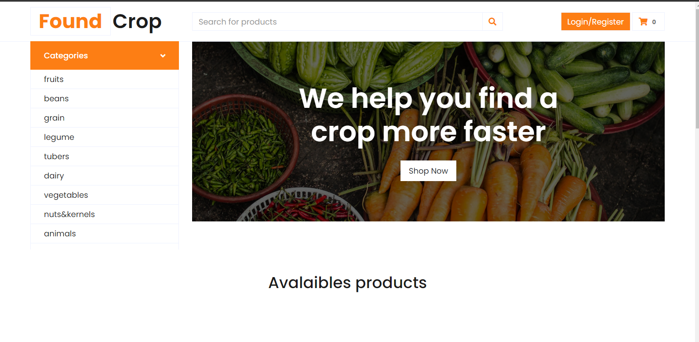
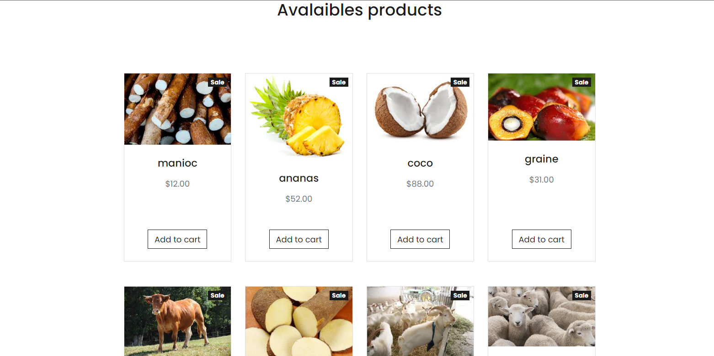

2. **A user registration area and a private area for everyone.**

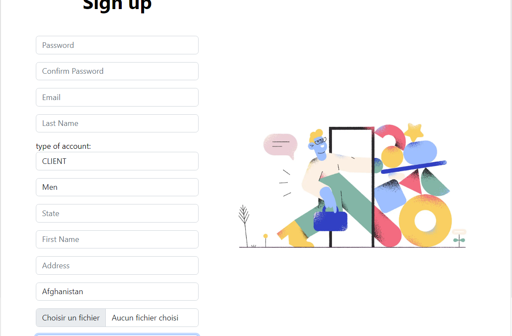

During registration, I choose a professional account where he can buy and sell or a customer account where he can only buy.

Being authenticate
You have access to the dashboard with your sales and purchase statistics
A space for adding, modifying and deleting products for professional accounts
A profile space

* **DASHBOARD**

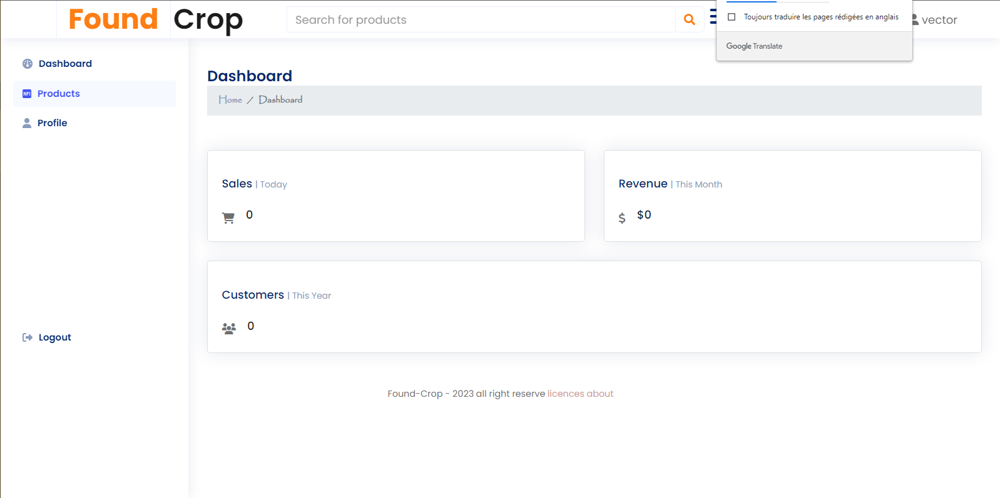

* **PRODUCTS**
    * **PRODUCTS VIEWS**
        * 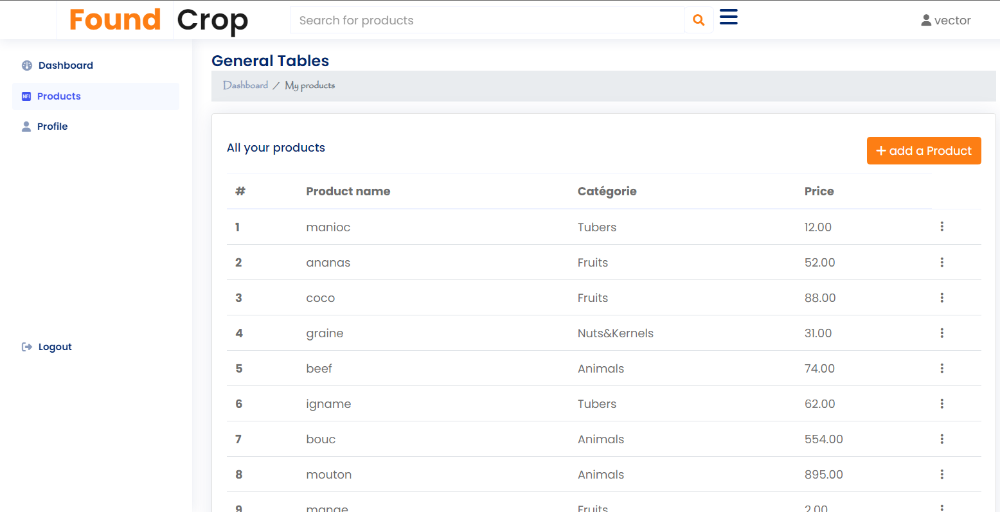
    * **PRODUCTS ADD**
        * 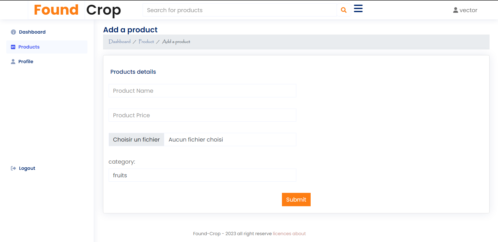
    * **PRODUCTS UPDATE**
        * 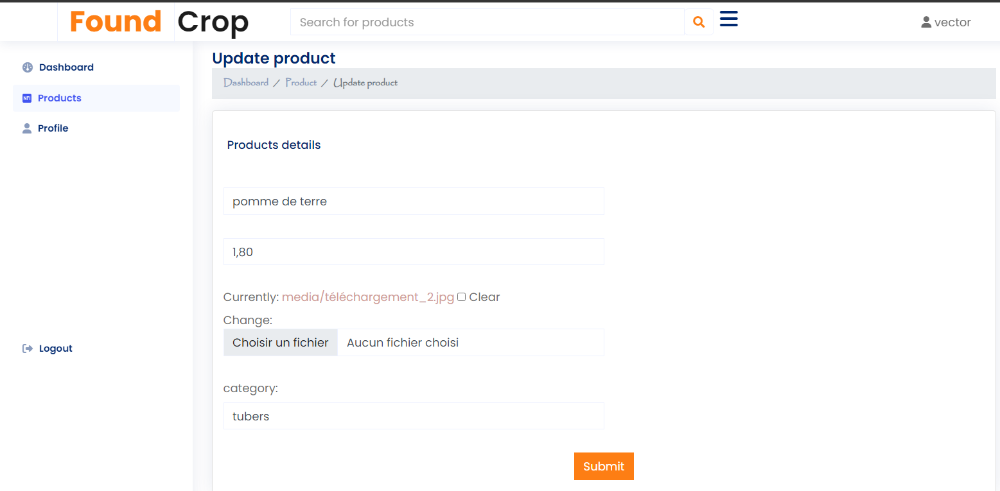
    * **PRODUCTS REMOVE**
        * 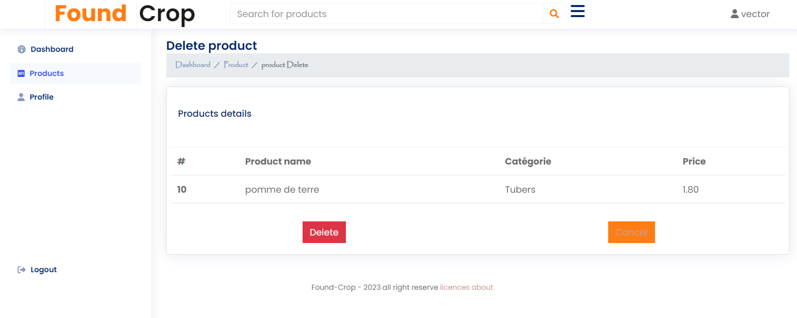
* **PROFILE**
    * **YOUR PERSONNAL INFORMATION**
        * 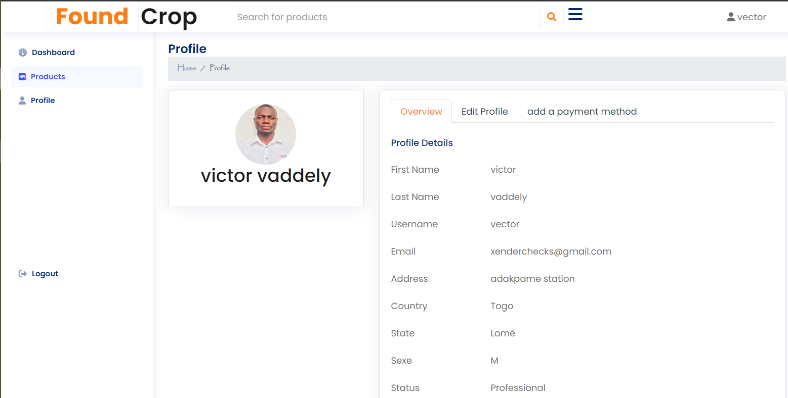
    * **UPDATE YOUR PERSONNAL INFORMATION**
        * 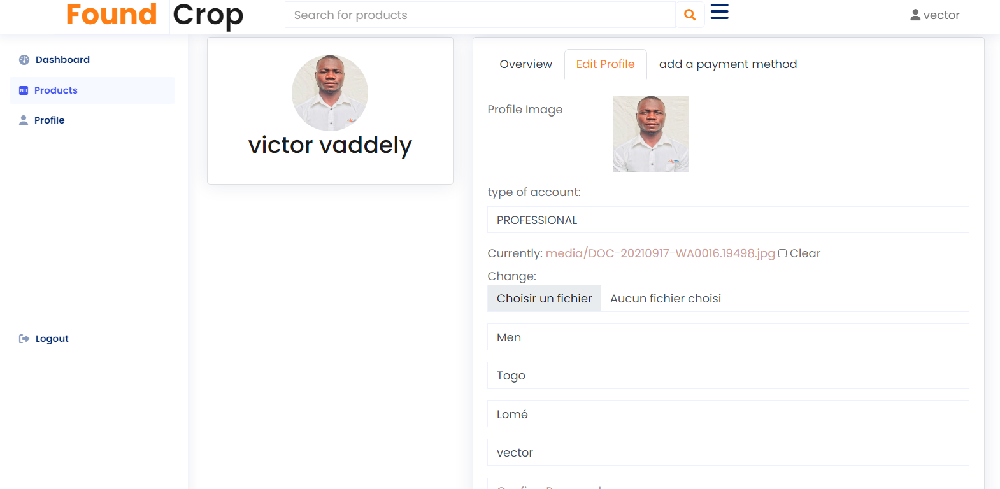
    * **ADD YOUR CARD INFORMATION FOR PAYMENT**
        * 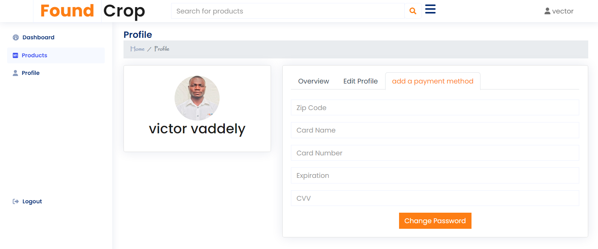

* **PAYMENT**
And finally a logout